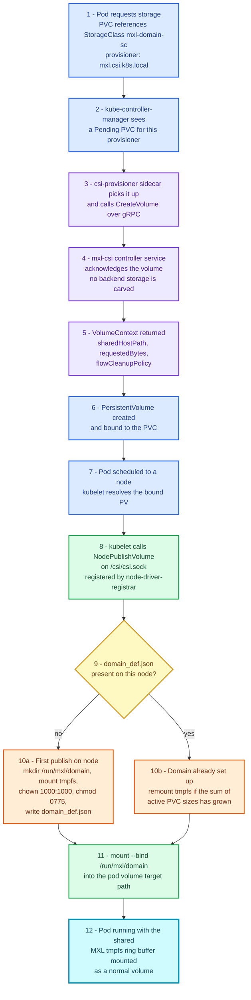
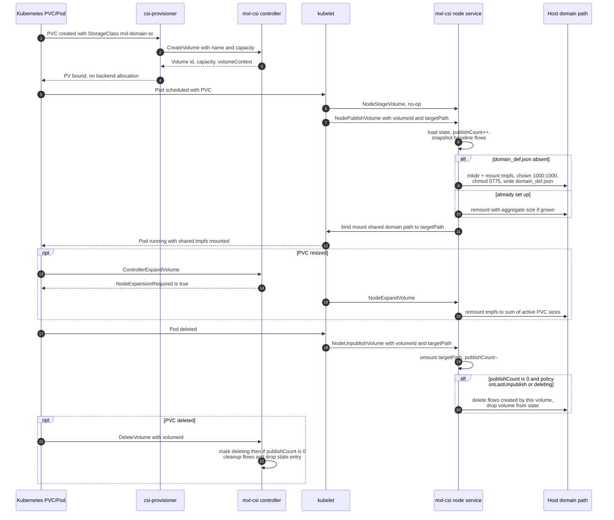

# ti-eng-mxl-k8s-csi
CSI driver for dynamic mxl tmpfs lifecycle, mount binding, and PVC-aware scaling

## Overview

This Container Storage Interface (CSI) driver enables Kubernetes pods to access mxl tmpfs ring buffers through standard Kubernetes PVC workflows. The goal is to abstract low-level host mount operations so application teams can consume mxl shared memory by referencing a StorageClass, without manually wiring hostPath mounts into each workload.

### Problem Solved

- **Before**: Applications needing access to mxl ring buffers required manual host-level setup, privileged container access, or volume mount configuration outside the Kubernetes API.
- **After**: Any pod can request access declaratively via PVC + StorageClass, and the CSI driver bind-mounts the shared mxl tmpfs path into the pod volume target.

### Important Behavior

This driver is **not a traditional dynamic provisioner** that allocates isolated per-PVC storage. Instead, it provides a **dynamic mount** of a shared host directory (default `/run/mxl/domain`) into pod volume target paths.

- PVC events are used as the Kubernetes control-plane trigger.
- The mounted data source remains a shared host tmpfs location.
- Per-volume backend allocation is intentionally bypassed.
- The shared tmpfs is owned by uid/gid `1000:1000` with mode `0775`; containers not running as uid `1000` or root need `securityContext.supplementalGroups: [1000]` at the pod level to get write access, since ownership is fixed per-node rather than per-volume.

### How It Works

1. **StorageClass**: Administrators create a StorageClass that references this mxl CSI driver.
2. **PersistentVolumeClaim**: Pods request storage by creating a PVC that uses the mxl StorageClass.
3. **Controller Intercept**: The controller service satisfies CSI create/delete volume calls so Kubernetes can complete its PVC lifecycle, but does not carve dedicated backend storage.
4. **Node Bind Mount**: On node publish, the driver bind-mounts the shared host path into the pod's requested target path.
5. **Domain Lifecycle**: On first publish on a node, the driver can create `/run/mxl/domain`, mount tmpfs, and apply domain permissions/profile.
6. **Pod Access**: The pod accesses the mount as a normal volume while the backing data remains the shared mxl tmpfs ring buffer.

### Provisioning Workflow



### Volume Lifecycle



### CSI Implementation Notes

- **Driver identity**: Defaults to name `mxl.csi.k8s.local`, version `0.2.5` (see `defaultDriverVersion` in `cmd/mxl-csi/main.go`).
- **Shared host path**: Defaults to `/run/mxl/domain`, configurable via `--shared-host-path` (or `MXL_SHARED_HOST_PATH`).
- **Identity service**: Advertises controller service capability.
- **Controller service**: Advertises `CREATE_DELETE_VOLUME` and `EXPAND_VOLUME` capabilities for PVC lifecycle and expansion workflows.
- **Create/Delete behavior**: Tracks per-volume requested capacity and cleanup policy metadata while keeping a shared-domain backend model.
- **Node service**: Uses `NodePublishVolume` and `NodeUnpublishVolume` for bind mount lifecycle and per-volume flow cleanup policy handling.
- **Expansion path**: Supports aggregate shared tmpfs growth using online remount based on active PVC requested sizes.
- **Unsupported operations**: Snapshots and several optional controller/node operations remain `Unimplemented` by design to keep the driver focused on mount abstraction.

### Merged Domain Lifecycle Capabilities

Version `0.2.0` merges core functionality that previously required the standalone domain lifecycle controller:

- Dynamic creation of `/run/mxl/domain` on node demand.
- Dynamic tmpfs mount of the shared MXL domain path with configured ownership and mode.
- Shared tmpfs growth via remount when active PVC requested capacity increases.
- Per-volume flow cleanup policy support (`onLastUnpublish` default, `onDelete` optional) to coordinate deletion behavior.

### Upgrade Notes (0.1.x -> 0.2.x)

- Driver default version is now `0.2.5`.
- Domain lifecycle behavior is merged into CSI node operations.
- The driver can create `/run/mxl/domain` and mount tmpfs on first publish.
- The standalone bootstrap DaemonSet becomes optional for CSI-based workflows.
- Expansion support is now enabled for shared tmpfs growth.
- `ControllerExpandVolume` and `NodeExpandVolume` are implemented for resize workflows.
- Capacity growth is applied to the shared tmpfs via remount, based on active PVC requested sizes.
- Flow cleanup behavior is policy-driven per volume.
- Default policy is `onLastUnpublish` for deterministic node-side cleanup.
- Optional `onDelete` policy keeps cleanup tied to delete lifecycle signaling.

Operational guidance:

- Validate memory headroom on nodes before enabling aggressive PVC growth.
- Roll out with canary nodes first and observe remount/stream stability under load.
- Keep `deploy/bootstrap/mxl-domain-volume-lc-daemonset.yaml` only if you require pre-provisioned host state before pod scheduling.

### New in Version 0.2.5

- **Reliable tmpfs setup detection**: The driver no longer relies on mount-table lookups or filesystem-type checks to decide whether `/run/mxl/domain` needs its initial tmpfs setup. Both approaches produced false positives — the container's own hostPath volumeMount always shows up as a mount, and `/run` is itself commonly tmpfs on systemd hosts. Detection now keys off the presence of `domain_def.json`, which only this driver ever writes, right after a successful mount.
- **Host-visible domain mount**: The `shared-host-path` volumeMount in the node DaemonSet now sets `mountPropagation: Bidirectional`, so the tmpfs mount created by the driver actually propagates to the real host mount namespace instead of staying private to the driver's own container. This matters for anything running directly on the host (e.g. a host-native `mxl` agent) that expects to see `/run/mxl/domain` outside of Kubernetes.
- **Per-node unique domain IDs**: `domain_def.json`'s `id` field is now a UUIDv5 deterministically derived from the node ID, instead of a single hardcoded UUID shared by every node. The `description` field also now includes the node name.

### Key Features

- **Dynamic Mount Binding**: Mounts are handled on-demand per pod/PVC request path.
- **Kubernetes-Native**: Uses standard CSI and Kubernetes volume APIs.
- **Abstraction**: Encapsulates mxl ring buffer host-mount complexity behind familiar storage interfaces.
- **Lightweight Behavior**: Minimal CSI surface, focused on mapping pods to shared mxl tmpfs.
- **Multi-Platform**: Supports Kubernetes and OpenShift deployments.

## Repository Structure

```text
ti-eng-mxl-k8s-csi/
├── cmd/
│   └── mxl-csi/                     # main entrypoint
├── build/
│   └── docker/                      # runtime image Dockerfiles
├── deploy/
│   ├── bootstrap/                   # optional standalone lifecycle manifest (legacy/fallback)
│   ├── helm/
│   │   └── mxl-csi/                 # Helm chart for CSI deployment
│   └── patches/
│       └── mxl-k8s-rc.20-patches/   # operator rc.20 value overrides and patches
├── tests/
│   ├── csi-test/                    # CSI dynamic provisioning scenario
│   └── qvest-mxl-k8s-test/          # static PV/PVC baseline scenario
├── go.mod
├── go.sum
└── README.md
```

## Installation

Install mxl-csi using the Helm chart in this repository.

For full prerequisites and installation commands, see:

- [deploy/helm/mxl-csi/README.md](deploy/helm/mxl-csi/README.md)

## Test Scenarios

This repository contains two end-to-end test folders that validate the same MXL media flow behavior with different storage approaches.
Together, these scenarios are designed to validate both the mxl-k8s-csi driver behavior and the Qvest mxl-k8s operator flow/mirror reconciliation behavior.

### Scenario 1: Static PV/PVC Wiring (qvest-mxl-k8s-test)

Use [tests/qvest-mxl-k8s-test/README.md](tests/qvest-mxl-k8s-test/README.md) when you want to validate cross-node MXL flow behavior with statically declared local PVs and PVCs.

- Focus: baseline operator and media-flow behavior across nodes.
- Storage model: static local PV/PVC manifests mapped to host path /run/mxl/domain.
- Includes: full manifest explanations, interconnect flow, apply order, and verification steps.

### Scenario 2: CSI Dynamic Provisioning (csi-test)

Use [tests/csi-test/README.md](tests/csi-test/README.md) when you want to validate the same media workflow using this CSI driver for dynamic provisioning and mount binding.

- Focus: replacing static PV/PVC wiring with CSI-backed dynamic claims.
- Storage model: inline ephemeral volumeClaimTemplate requests using StorageClass mxl-domain-sc.
- Includes: file-by-file explanation and ordered apply sequence for flow, producer, receiver, consumer, and MediaMTX manifests.

### Which One To Run

- Start with [tests/qvest-mxl-k8s-test/README.md](tests/qvest-mxl-k8s-test/README.md) for baseline functional validation of the MXL operator flow/mirror path.
- Run [tests/csi-test/README.md](tests/csi-test/README.md) to validate CSI-based dynamic provisioning behavior in the same test pattern.

## Build Images

Prebuilt multi-architecture images for `linux/amd64` and `linux/arm64` are already available in GHCR:

- [`ghcr.io/cbcrc-ea/mxl-k8s-csi`](https://github.com/orgs/cbcrc-ea/packages/container/package/mxl-k8s-csi)

If you wish to build images locally instead, use the steps below.

This repository includes two Dockerfiles:

- `build/docker/Dockerfile`: default runtime image based on Alpine.
- `build/docker/Dockerfile.ubi`: OpenShift-friendly runtime image based on Red Hat UBI minimal.

Build with Docker:

```bash
# Alpine-based image (default Dockerfile)
docker build -f build/docker/Dockerfile -t ti-eng-mxl-k8s-csi:alpine .

# UBI-based image (explicit Dockerfile)
docker build -f build/docker/Dockerfile.ubi -t ti-eng-mxl-k8s-csi:ubi .
```

Build with Podman:

```bash
# Alpine-based image
podman build -f build/docker/Dockerfile -t ti-eng-mxl-k8s-csi:alpine .

# UBI-based image
podman build -f build/docker/Dockerfile.ubi -t ti-eng-mxl-k8s-csi:ubi .
```

## OpenShift Tag and Push Example

Replace `quay.io/<org>` with your registry namespace:

```bash
# Example with Docker
docker tag ti-eng-mxl-k8s-csi:ubi quay.io/<org>/ti-eng-mxl-k8s-csi:ubi
docker push quay.io/<org>/ti-eng-mxl-k8s-csi:ubi

# Example with Podman
podman tag ti-eng-mxl-k8s-csi:ubi quay.io/<org>/ti-eng-mxl-k8s-csi:ubi
podman push quay.io/<org>/ti-eng-mxl-k8s-csi:ubi
```
