# k3s-test: Cross-Node MXL Flow Sharing Validation

This folder contains a full test scenario to validate cross-node sharing of MXL flows in Kubernetes using Qvest's `mxl-k8s` operator.

## Test Goal

Validate that:

1. A producer pod creates an MXL flow on node A.
2. The node-local `mxl-domain-agent` observes the new flow in `/run/mxl/domain` and publishes flow/domain status through the mxl CRDs.
3. A receiver declaration causes the operator to create a flow mirror toward node B.
4. The mirrored flow appears in node B's MXL domain (`/run/mxl/domain`, tmpfs ring buffer).
5. A consumer pod on node B reads that flow, re-encodes it, and publishes it to MediaMTX.
6. The stream is viewable externally via RTSP.

## Manifests In This Folder

### Domain Lifecycle and Storage

- [mxl-domain-volume-lc-daemonset.yaml](mxl-domain-volume-lc-daemonset.yaml)
  - DaemonSet that ensures `/run/mxl/domain` exists on each node and is mounted as tmpfs.
  - This is the `mxl-domain-volume-lifecycle-controller` that was previously run as a Deployment and converted to a DaemonSet so setup happens automatically on every worker node (instead of only one targeted node).
  - This is host-level lifecycle setup for the MXL domain path.

- [mxl-domain-pv.yaml](mxl-domain-pv.yaml)
  - Static `PersistentVolume` for node `mtllppdmh002`.
  - Maps local path `/run/mxl/domain` with node affinity.

- [mxl-domain-pv-1.yaml](mxl-domain-pv-1.yaml)
  - Static `PersistentVolume` for node `mtllppdmh001`.
  - Maps local path `/run/mxl/domain` with node affinity.

- [mxl-domain-pvc.yaml](mxl-domain-pvc.yaml)
  - PVC bound to `mxl-domain-pv` (consumer side/node `mtllppdmh002`).

- [mxl-domain-pvc-1.yaml](mxl-domain-pvc-1.yaml)
  - PVC bound to `mxl-domain-pv-1` (producer side/node `mtllppdmh001`).

### Flow Definition and Operator Signaling

- [mxl-video-flow.yaml](mxl-video-flow.yaml)
  - `ConfigMap` containing `flow.json` for the producer.
  - Defines a 1080p29 progressive video flow (`30000/1001`, v210, BT.709).
  - Flow ID used across the test:
    - `5fbec3b1-1b0f-417d-9059-8b94a47197ed`

- [mxl-receiver.yaml](mxl-receiver.yaml)
  - `MxlReceiver` CR selecting consumer pods by label.
  - Declares that flow ID as desired on the receiver side.
  - This is the trigger the operator uses to create a flow mirror to the destination node.

### Producer and Consumer Workloads

- [media-producer.yaml](media-producer.yaml)
  - Producer pod pinned to node `mtllppdmh001`.
  - Mounts producer PVC at `/run/mxl/domain`.
  - Runs `mxl-gst-testsrc` (GStreamer) with flow metadata from `flow.json`.
  - Init container removes stale flow directory before startup.

- [media-consumer.yaml](media-consumer.yaml)
  - Consumer deployment pinned to node `mtllppdmh002`.
  - Mounts consumer PVC at `/run/mxl/domain`.
  - FFmpeg-based app reads the mirrored MXL flow and publishes RTSP to internal MediaMTX service.

### Streaming Endpoint

- [mediamtx.yaml](mediamtx.yaml)
  - Deploys MediaMTX plus two services:
  - `mediamtx-service-inside` (`ClusterIP`) for in-cluster publisher access.
  - `mediamtx-service-outside` (`NodePort`) exposing RTSP on `30554`.

## How They Interconnect

<p align="center">
  
</p>

## Expected Runtime Sequence

1. The domain lifecycle DaemonSet mounts tmpfs at `/run/mxl/domain` on each node.
2. Producer starts and generates a 1080p29 MXL flow.
3. Source-node `mxl-domain-agent` observes the flow in `/run/mxl/domain` and updates mxl CRD state.
4. `MxlReceiver` indicates interest in that flow for consumer-labeled pods.
5. Operator receiver reconciliation creates and reconciles `MxlFlowMirror` intent toward the consumer node.
6. Mirrored ring-buffer data appears in node B's `/run/mxl/domain`.
7. Consumer reads the flow, re-encodes it, and publishes to MediaMTX (`/stream`).
8. Viewer connects to RTSP NodePort and plays the stream.

## Apply Order (Suggested)

```bash
kubectl apply -f k3s-test/mxl-domain-volume-lc-daemonset.yaml
kubectl apply -f k3s-test/mxl-domain-pv.yaml
kubectl apply -f k3s-test/mxl-domain-pv-1.yaml
kubectl apply -f k3s-test/mxl-domain-pvc.yaml
kubectl apply -f k3s-test/mxl-domain-pvc-1.yaml
kubectl apply -f k3s-test/mediamtx.yaml
kubectl apply -f k3s-test/mxl-video-flow.yaml
kubectl apply -f k3s-test/media-consumer.yaml
kubectl apply -f k3s-test/mxl-receiver.yaml
kubectl apply -f k3s-test/media-producer.yaml
```

## Verification Checklist

```bash
kubectl -n qvest-mxl-test get pods -o wide
kubectl -n qvest-mxl-test get pvc
kubectl -n qvest-mxl-test logs pod/mxl-producer
kubectl -n qvest-mxl-test logs deploy/mxl-k8s-video-flow-reader
kubectl -n qvest-mxl-test logs deploy/mxl-mediamtx
```

If your cluster exposes these CRDs, also check:

```bash
kubectl -n qvest-mxl-test get mxlreceivers
kubectl -n qvest-mxl-test get mxlflows
kubectl -n qvest-mxl-test get mxlflowmirrors
```

## RTSP Playback (VLC)

- URL example:
  - `rtsp://<mediamtx-nodeIP>:30554/stream`
- In VLC, force RTSP-over-TCP:
  - Preferences -> Input / Codecs -> RTSP (RTP over RTSP (TCP))

Note: for NodePort, use any reachable Kubernetes node IP with port `30554`. The exact IP depends on your environment.

## Notes About Dynamic vs Static Volume Wiring

This test currently uses statically declared local PVs/PVCs for each node. That validates the media/control-plane behavior, while your CSI driver project aims to replace this static wiring with dynamic mount binding to the shared host MXL domain path.

## Migration To CSI StorageClass

When you migrate this test to the CSI workflow (StorageClass provisioner `mxl.csi.k8s.local`), the static local PV wiring is no longer needed.

You can remove these static manifests:

- [mxl-domain-pv.yaml](mxl-domain-pv.yaml)
- [mxl-domain-pv-1.yaml](mxl-domain-pv-1.yaml)

You should replace these PVC manifests with CSI-based PVCs (no `volumeName`, use the CSI StorageClass name, for example `mxl-domain-sc`):

- [mxl-domain-pvc.yaml](mxl-domain-pvc.yaml)
- [mxl-domain-pvc-1.yaml](mxl-domain-pvc-1.yaml)

You should keep this manifest (or provide an equivalent host bootstrapping mechanism):

- [mxl-domain-volume-lc-daemonset.yaml](mxl-domain-volume-lc-daemonset.yaml)

Reason: the CSI driver bind-mounts the shared host path into pods, but does not create and mount tmpfs for `/run/mxl/domain` by itself. The lifecycle DaemonSet is what ensures that host path exists as a tmpfs-backed MXL domain on every worker node.

Workload manifests to update for CSI migration:

- [media-producer.yaml](media-producer.yaml)
- [media-consumer.yaml](media-consumer.yaml)

Only the PVC reference needs to point to CSI-backed claims; the MXL path inside containers remains `/run/mxl/domain`.